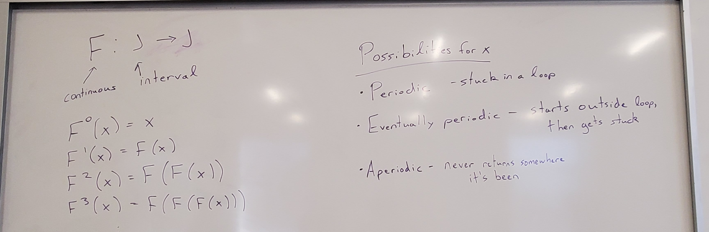
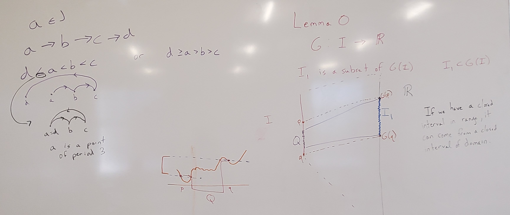
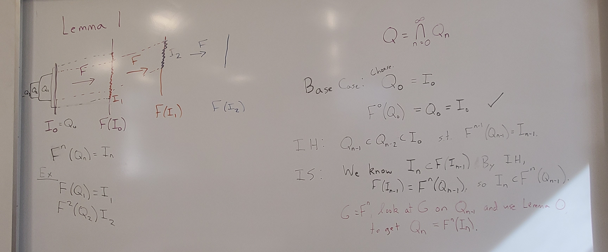

This week we dove into Li and Yorke's 1975 paper "Period Three Implies Chaos."

# In Class

We continued discussing [Li and Yorke's paper "Period Three Implies Chaos"](https://www.its.caltech.edu/~matilde/LiYorke.pdf).

As a reminder, the goal of looking at this paper is to understand the statement of the main result (Theorem 1), the ideas of the proof of the first part of Theorem 1 (proof of T1), and the proof in Appendix 1 that a point of period 5 does not guarantee a point of period 3.

In class, we talked through the general idea of the statement of the theorem as well as the statements and proofs of Lemmas 0 and 1.

{fig-alt="Whiteboard setting the stage for Li and Yorke paper. F is a continuous function from J to J, where J is an interval. The notation F^n(x) is the result of applying F to x n times. As a baseline, F^0(x) = x. The right side of the board shows possibilities for x: periodic (gets stuck in a loop), eventually periodic (doesn't start in a loop but gets there), aperiodic (never returns to where it's been before)."}

{fig-alt="Whiteboard discussion of Li and Yorke paper. Left side shows the condition on the points a, b, c, and d, especially the d <= a < b < c case. One image shows that this is a cycle of period 3 when a = d. The right side of the board illustrates Lemma 0. A vertical line segment on the left is the interval I, and a longer line on the right is the real numbers. The image of I under a map G is the real line, which is shown with dotted lines from the endpoints of I out to the \"endpoints\" of the line representing the real numbers. Inside the real numbers, an interval I1 is shaded in blue. Its endpoints are labeled G(p) and G(q), and there are dotted lines back to points in the interval I labeled p and q. In part of the area between them, a smaller interval is shaded and labeled Q. The main idea of the theorem is that if we have a closed interval in the range, it can come from a closed interval in the domain. The reason the closed interval Q in the domain isn't necessarily [p,q] is shown in another drawing on the board, with a desired interval marked and two points marked that are at the edges of that interval. Not everything in the continuous squiggly line between them stays within the interval, but if you move in from each side, there's a smaller chunk where everything does stay between them."}

{fig-alt="Whiteboard discussion of Lemma 1. A sketch of the lemma shows a sequence of intervals. The first is I0, which then maps to an interval that contains I1. I1 then maps to an interval F(I1) that contains I2, and so forth. I0 is marked as equal to Q0, and then Q1, Q2, etc. are shown nested inside Q0. With dotted lines, Q1 is shown as mapping to I1. Q2 is shown going to I2 through two mapping steps. Below the diagram, F^n(Q_n) = I_n is written. The right side of the board expands the induction proof of Lemma 1. In the base case, we choose Q0 = I0, and then we check that F^0(Q0) = I0. The induction hypothesis is that there exists Q_{n-1} in I0 such that F^(n-1)(Q_{n-1}) = I_{n-1}. In the induction step, we know that I_n is a subset of F(I_{n-1}). By the induction hypothesis, F(I_{n-1}) = F^n(Q_{n-1}), so I_n is a subset of F^n(Q_{n-1}). If we get G = F^n and look at G on the interval Q_{n-1}, we can apply Lemma 0. From Lemma 0, we can get Q_n that meets the needed condition."}

# Homework 7 -- Due Friday, Mar. 27 by the start of class

Both of the options below introduce Smale's horseshoe map, mentioned in the Li and Yorke paper between Lemma 1 and Lemma 2.

📖 [**Reading Option 1:** How We Can Make Sense of Chaos](https://www.quantamagazine.org/how-mathematicians-make-sense-of-chaos-20220302/)

📺[**Watching Option 2:** Smale's Horseshoe Map](https://www.youtube.com/watch?v=Xx67aAeAm2M)

[**Homework Reading Questions**](hws/hw-7.qmd)

::: callout-caution
# Submission

Submit your work to the HW 7 assignment on Blackboard!
:::
