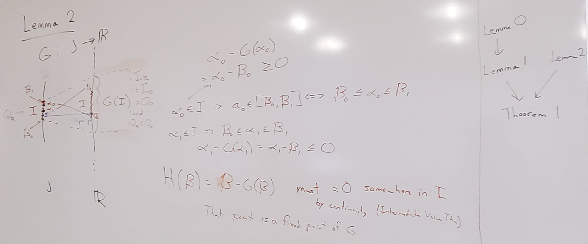
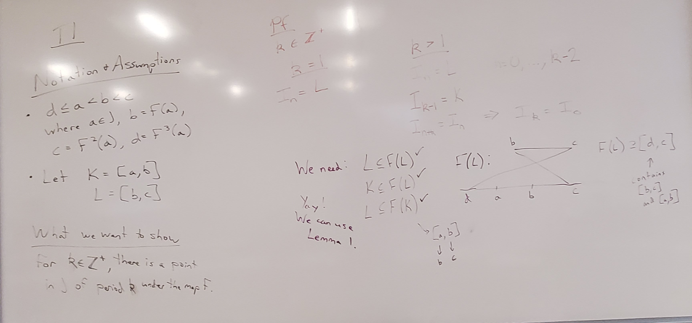
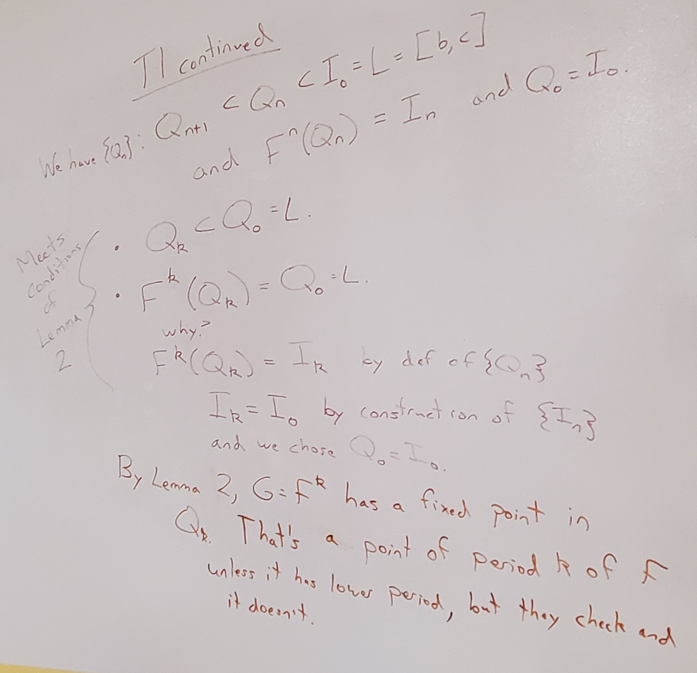

This week we wrapped up our discussion of Li and Yorke's 1975 paper "Period Three Implies Chaos."

# In Class

We continued discussing [Li and Yorke's paper "Period Three Implies Chaos"](https://www.its.caltech.edu/~matilde/LiYorke.pdf).

As a reminder, the goal of looking at this paper is to understand the statement of the main result (Theorem 1), the ideas of the proof of the first part of Theorem 1 (proof of T1), and the proof in Appendix 1 that a point of period 5 does not guarantee a point of period 3.

In [Week 8](weeks/week-8.qmd) we had talked through the statements and proofs of Lemma 0 and Lemma 1. This week, we talked through the statement and proof of Lemma 2 as well as the proof of Theorem 1.

We closed by talking about the limits on weather forecasting due to chaos, with references to [changes in forecasting skill over time](https://ourworldindata.org/weather-forecasts) but a limit of about two weeks.

{fig-alt="Lemma 2. G: J to R. An interval I in J maps to G(I), which contains I. Define I to be from beta_0 to beta_1. Choose alpha_0 in I such that G(alpha_0) = beta_0, and similar for beta_1. Then alpha_0 - G(alpha_0) = alpha_0 - beta_0 >= 0 because alpha_0 is between beta_0 and beta_1. Similarly, alpha_1 - G(alpha_1) = alpha_1 - beta_1 <= 0. If we look at the function H(beta) = beta - G(beta), that must equal 0 somewhere in I because it's non-negative at alpha_0 and non-positive at alpha_1. So by continuity/Intermediate Value Theorem, we must have 0 somewhere. And that point is a fixed point of G."}

{fig-alt="For Theorem 1, our notation and assumptions are: d <= a < b< c where a is in J, F(a) = b, F(b) = c, F(c) = d. Let K = [a,b] and L=[b,c]. We want to show that for a positive integer k, there is a point in J of period k under map F. In the proof, if k= 1, let I_n = L. if k> 1, let I_n = L for n = 0 through k-2, then I_k-1 = K, and then after that have a cycle of length k: I_n+k = I_n. So notably, I_k = I_0. We want to be able to use Lemma 1, so to meet those conditions we need to show that L is a subset of F(L), K is a subset of F(L), and L is a subset of F(K). This works out if we look at the endpoints of L and K and what values they map to."}

{fig-alt="Theorem 1 continued: from Lemma 1, we have a set of nested intervals Q_n all inside L, with F^n(Q_n) = I_n and Q_0 = I_0. We want to show that these Qs meet the conditions of Lemma 2. Q_k is a subset of Q_0. We also have F^k(Q_k) = Q_0 becasue F^k(Q_k) = I_k by definition of the Qs, and I_k = I_0 by how we built the Is, and we chose Q_0 = I_0. So this meets the conditions of Lemma 2! This gives us a fixed point inside Q_k of G = F^k. We can check that this point doesn't have period less than k, so this is a point of period k under F."}

# Homework 8 -- Due Friday, Apr. 3 by the start of class

[**Homework Questions**](hws/hw-8.qmd)

::: callout-caution
# Submission

Submit your work to the HW 8 assignment on Blackboard!
:::
